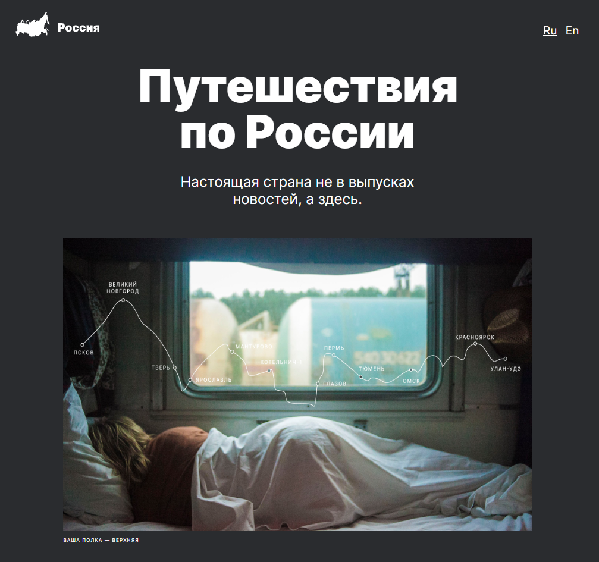

<h1>Проектная работа "Путешествия по России"</h1>

<h2>Данная работа выполнена по макету Figma предоставленный Яндекс.Практикум</h2>
<h2>Цель проекта:</h2>
<ul>
  <li><h3>С помощью язык разметки HTML и CSS сверстать макет по методологии БЭМ</h3></li>
  <li><h3>Отточить навыки применения Grid Layout</h3></li>
  <li><h3>Получить полностью адаптивный сайт для десктопных экранов и мобильных устройств</h3></li>
  <li><h3>Научиться правильно использовать медиазапросы для корректного отображения сайта в брэйкпоинтах</h3></li>
</ul>
